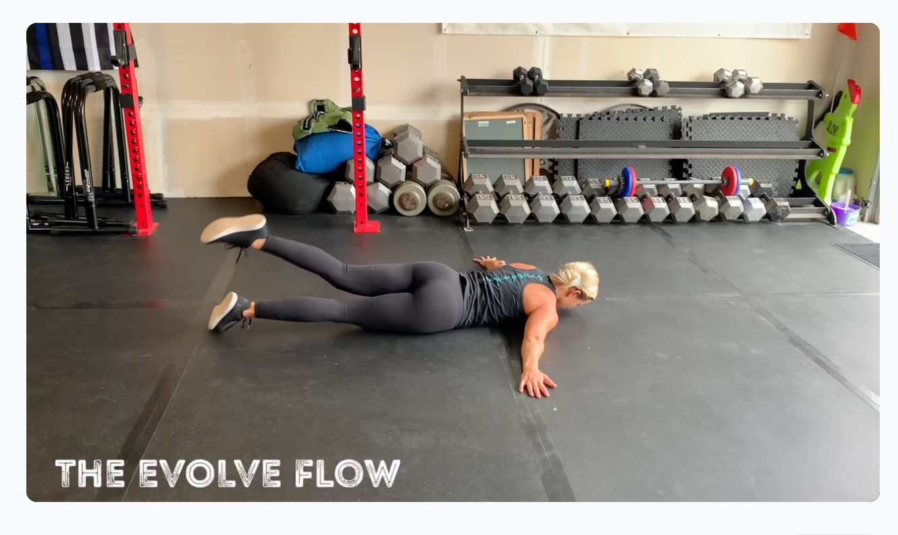

# Bulk Upload — Feature Spec

**Status:** Planned — not yet implemented
**Decision needed:** Coach feedback required before building. See Questions for Coaches below.

---

## Background

The existing `upload.html` handles one video at a time. Coaches need a way to upload many videos at once. Two approaches are on the table — a **Web UI** built into the app, and a **Node.js CLI script** run locally on a computer with the video files.

The initial migration is expected to be a one-time event. After that, ongoing uploads will likely use the existing single-upload page. The bulk tools exist to solve that first migration and any occasional batch needs.

---

## Vision OCR — Auto-Detecting Movement Names

Many of the videos have the movement name as a text overlay in the first frame — visible right at 0:00. Rather than requiring coaches to type names or prepare a spreadsheet, both upload options can use **Claude Vision** to read the name directly from the video.


*"THE EVOLVE FLOW" — bottom-left text overlay, visible from frame 0. Claude Vision reads this and pre-fills the movement name.*

### How it works

1. Extract the first frame of each video as an image
2. Send the image to Claude Vision API with a prompt: *"What is the movement name shown in this video frame? Return only the name."*
3. Pre-fill the movement name field with the result
4. Coach confirms or corrects before uploading

### Fallback behavior

If Vision can't confidently read a name (no title card, blurry frame, ambiguous text):
- Fall back to the filename-based suggestion (strip extension, fix dashes/underscores, title-case)
- Flag the row so the coach knows to review it manually

### In the Web UI
Frame extraction uses the HTML5 `<canvas>` + `<video>` API — no dependencies, works entirely in the browser. The frame is sent to a Supabase Edge Function that calls Claude Vision and returns the suggested name.

### In the CLI Script
Frame extraction uses `ffmpeg` (installed locally). The script extracts frame 0 from each video, calls Claude Vision, and populates the name before uploading.

### CSV override
If a `metadata.csv` is present alongside the videos, the CSV name takes priority over the Vision result. This lets coaches who want to pre-define names, alt names, tags, and comments do so — Vision is skipped for any row where a name is already provided.

---

## Options at a Glance

| | Option A: Web UI | Option B: Node.js CLI Script |
|---|---|---|
| **Where it runs** | Browser — any device, no setup | Terminal on a Mac or PC with Node.js installed |
| **Best for** | Coaches comfortable in a browser | Tom running the initial migration, or coaches comfortable with Terminal |
| **File limit** | ~25 per session (browser reliability) | Unlimited — resumable if it fails mid-run |
| **Name source** | Vision OCR → confirm, or filename fallback | Vision OCR auto-populated, or CSV override |
| **Other metadata** | Edit per movement after upload | Optional CSV for tags, alt names, comments upfront |
| **Tech comfort needed** | None — works like the existing upload page | Low — run one command in Terminal |

---

## Option A: Web UI (in-browser)

Coaches visit a new `bulk-upload.html` page, select multiple video files (or drag and drop), wait while Vision reads the name from each video's first frame, then review the queue and click **Upload All**.

### How it looks

```
[ #  |  Filename           |  Movement Name         |  Status          ]
[ 1  |  rdl.mp4            |  [Romanian Deadlift ]  |  Pending         ]
[ 2  |  back-squat.mp4     |  [Back Squat        ]  |  Pending         ]
[ 3  |  push-press.mp4     |  [Push Press        ]  |  Uploading 42%   ]
[ 4  |  evolve-flow.mp4    |  [             ?    ]  |  ⚠ Review name   ]
[ 5  |  lateral-raise.mp4  |  [Lateral Raise     ]  |  ✓ Done          ]
```

- Vision reads the name from frame 0 of each video; coaches correct anything that looks wrong
- Rows where Vision couldn't read a name are flagged with ⚠ for manual entry
- A row that errors on upload is marked in place; the rest of the queue continues
- Summary banner at the end: `"4 uploaded successfully, 1 failed."`
- **Soft cap of 25 files per session** with a warning if exceeded

### Pros
- No setup — works for any coach right in the browser
- Names auto-suggested from the video itself, not the filename
- Fits naturally into the existing app

### Cons
- ~25 file limit per session due to browser reliability
- Cannot add tags, alt names, or comments during bulk upload (do it afterward per movement)
- If the tab closes mid-upload, progress is lost for remaining files

---

## Option B: Node.js CLI Script

A script run locally on the computer that holds the video files. It uses ffmpeg to extract frame 0 from each video, calls Claude Vision to read the movement name, and uploads everything to R2 and Supabase in sequence. Designed to be run by Tom or a coach comfortable with Terminal.

### Folder layout

```
/import/
  rdl.mp4
  back-squat.mp4
  push-press.mp4
  metadata.csv        ← optional, overrides Vision for any listed video
  ...
```

### How it runs

**Step 1 — Open Terminal and run the script:**
```bash
node /path/to/scripts/import.js
```

**Step 2 — It will ask: "Where is your video folder?"**
Drag your folder from Finder onto the Terminal window and press Enter. The path will fill in automatically.

**Step 3 — It will ask: "What is your email?"**
Type your Evolve Coaches login email and press Enter.

**Step 4 — It will ask: "What is your password?"**
Type your password and press Enter. (It won't show as you type — that's normal.)

**Step 5 — Watch it go.**
The script reads each video, figures out the movement name, and uploads. It prints a line for each video:
```
✓  Romanian Deadlift
✓  Back Squat
⚠  evolve-flow.mp4 — couldn't read name, skipped (add manually)
✓  Push Press
```

**Step 6 — Done.**
It prints a summary: `"47 uploaded, 2 skipped."` Any skipped videos can be uploaded one at a time through the normal upload page.

If anything goes wrong mid-run — just run it again. It skips videos that already made it in.

### Optional metadata.csv

Only needed if coaches want to pre-define alt names, tags, or comments upfront. The `name` column is optional — Vision fills it in if omitted.

| Column | Required | Description |
|---|---|---|
| `filename` | Yes | Video file name including extension (e.g. `rdl.mp4`) |
| `name` | No | Overrides Vision result if provided |
| `alt_names` | No | Alternative names separated by `\|` |
| `tags` | No | Tags separated by `\|` — new ones will be created automatically |
| `comments` | No | Coach notes shown on the movement detail page |

### Pros
- Handles unlimited videos — no session reliability concerns
- Resumable — safe to re-run after failures
- Vision reads names automatically — no spreadsheet required for basic use
- CSV available for coaches who want full metadata control upfront
- Runs headlessly — no browser tab to keep open

### Cons
- Requires Node.js and ffmpeg installed on the computer with the videos
- Requires someone comfortable opening a Terminal and running one command
- Tom needs to be present (or credentials need to be shared carefully)

### Portability note

If the script needs to run on someone else's computer, hardcode the credentials directly in the script before handing it over (not committed to the repo, deleted after use). Credentials needed: R2 Access Key ID + Secret, R2 bucket name + endpoint, Supabase URL + service role key, Anthropic API key (all in 1Password).

---

## File Count Limits

The real constraint for Option A is **time and browser session reliability**:

| Avg video size | Upload speed | Time per video | 25 videos | 500 videos |
|---|---|---|---|---|
| 50 MB | 10 Mbps | ~40 sec | ~17 min | ~5.5 hours |
| 100 MB | 10 Mbps | ~80 sec | ~33 min | ~11 hours |

A browser tab open for several hours is vulnerable to computer sleep, network drops, or a tab crash. There is no resume capability in the web UI. Option B does not have this constraint.

---

## Questions for Coaches

These need answers before building:

- [ ] **How many videos do you need to upload for the initial migration?** (dozens vs. hundreds)
- [ ] **Is this a one-time migration, or will you need to batch-upload periodically after that?**
- [ ] **Are the videos already organized in one folder on a Mac/PC, or scattered across devices?**
- [ ] **Are you comfortable opening Terminal and running one command**, or would you prefer everything stays in the browser? *(No wrong answer — just helps us build the right tool)*
- [ ] **Do you want to add tags, alt names, and comments at upload time**, or is it fine to fill those in afterward per video?
- [ ] **Should bulk upload be available to all coaches, or admins only?**

---

## Dev Implementation Notes

*For the dev picking this up after coach feedback.*

### Shared: Vision Edge Function

Both options need a Supabase Edge Function that accepts a base64-encoded image and returns a movement name. Create `supabase/functions/vision-name/index.ts`:
- Validates auth (any logged-in user)
- Calls Anthropic Claude Vision API with the image and prompt: *"What is the movement or exercise name shown as text in this image? Return only the name, nothing else. If no name is visible, return an empty string."*
- Returns `{ name: string }`
- Anthropic API key stored as a Supabase secret

### If Option A is chosen — files to create/modify

- **Create** `bulk-upload.html` — same nav/head as `upload.html`; multi-file drop zone (`#file-drop`), queue table (`#upload-queue`), `#upload-all-btn`, `#clear-btn`, `#bulk-summary`
- **Create** `js/bulk-upload.js` — `requireAuth()`, file→queue builder; for each video extract frame 0 via `<canvas>` + `<video>`, call `vision-name` edge function, populate name field; sequential `uploadAll()` loop using existing `callEdgeFunction('r2-upload-url')` + `uploadToR2()` + Supabase insert; `MAX_FILES = 25` constant
- **Modify** `css/style.css` — add `.bulk-queue`, `.bulk-row`, `.bulk-status` (variants: `.is-uploading`, `.is-done`, `.is-error`, `.is-review`), `.bulk-summary`
- **Modify** `tests/desktop.spec.js` — smoke test: navigate to `/bulk-upload.html`, expect `#file-drop` and `#upload-all-btn` visible

Key code references: auth helpers + `uploadToR2` in `js/auth.js`; single upload pattern in `js/upload.js`.

### If Option B is chosen — files to create

- **Create** `scripts/import.js` — for each video: extract frame 0 with `ffmpeg`, call Claude Vision API, merge with CSV if present, create missing tags in Supabase, upload video to R2 via AWS SDK (`@aws-sdk/client-s3`), insert movement record; skips names that already exist; prints pass/fail summary
- **Dependencies:** `@aws-sdk/client-s3`, `@anthropic-ai/sdk`, `csv-parse`, `fluent-ffmpeg`
- Credentials hardcoded per run (not committed); deleted after use
